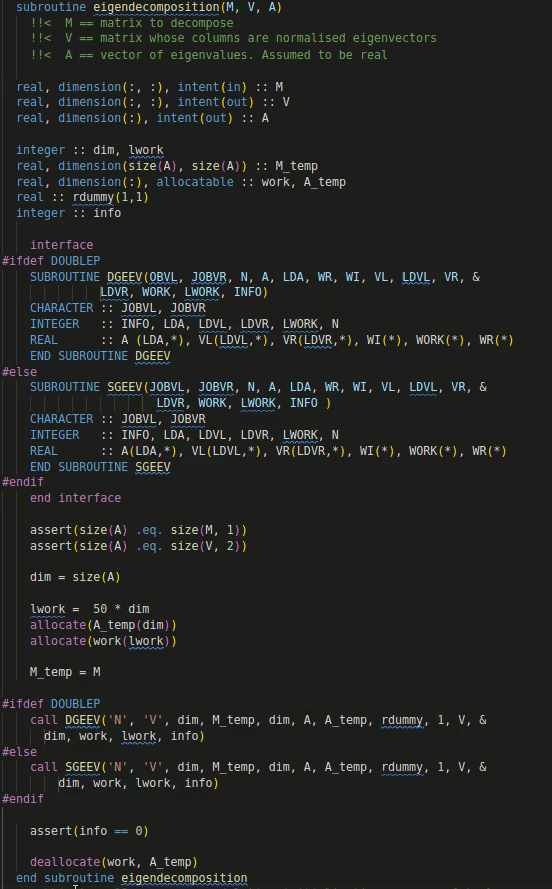
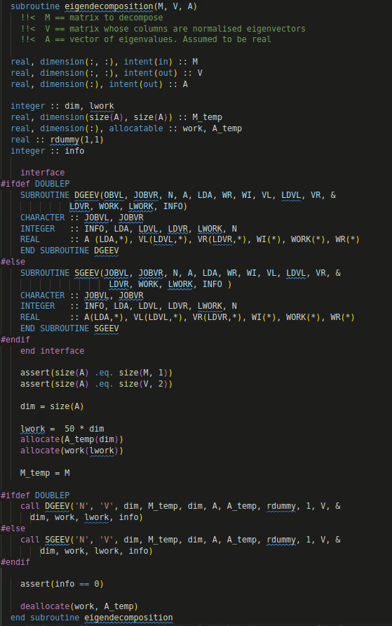

# Modern Fortran language support for VSCode

[](https://github.com/krvajal/vscode-fortran-support/actions)
[](https://marketplace.visualstudio.com/items?itemName=krvajalm.linter-gfortran)
[](https://marketplace.visualstudio.com/items?itemName=krvajalm.linter-gfortran)
[](https://marketplace.visualstudio.com/items?itemName=krvajalm.linter-gfortran)
[](http://opensource.org/licenses/MIT)

## Key Features

- Syntax highlighting (Free and Fixed forms)
- Hover support
- Autocompletion support
- Peek/Go to definitions and references
- Linting support i.e. error wiggles for `gfortran`, `flang` and `ifort`
- Symbols outline support for functions, subroutines, modules, etc.
- Native support leveraging the `fortran-language-server`
- Debugger, uses Microsoft's [C/C++ extension](https://github.com/Microsoft/vscode-cpptools)
- Formatting with [findent](https://github.com/gnikit/findent-pypi) or [fprettify](https://github.com/pseewald/fprettify)
- Code snippets (more can be defined by the user [see](https://code.visualstudio.com/docs/editor/userdefinedsnippets#_create-your-own-snippets))


## Settings

You can control the include paths to be used by the linter with the `fortran.linter.includePaths` setting.
The `linter.includePaths` should match the include requirements for your projects compilation.

> NOTE: if a glob pattern is used only directories matching the pattern will be included.

```jsonc
{
  "fortran.linter.includePaths": ["/usr/include/**", "${workspaceFolder}/include/**"]
}
```

By default the `gfortran` executable is assumed to be found in the path. In order to use a different one or if it can't be found in the path you can point the extension to use a custom one with the `fortran.linter.compilerPath` setting.

```jsonc
{
  "fortran.linter.compilerPath": "/usr/local/bin/gfortran-11.2"
}
```

If you want to pass extra options to the `gfortran` executable or override the default one, you can use the setting `fortran.linter.extraArgs`. Default value is `-Wall` (or `-warn all` for ifort).

```jsonc
{
  "fortran.linter.extraArgs": ["-Wall"]
}
```

To show the symbols in the file outline enable `provide.symbols`. Symbols can be
served by the fortran-language-server, the built-in, both or none. By default
`fortls` is used.

```jsonc
{
  "fortran.provide.symbols": "fortls" | "Built-in" | "Both" | "Disable"
}
```

You can also configure the case for fortran intrinsics auto-complete by using

```jsonc
{
    "fortran.preferredCase": "lowercase" | "uppercase"
}
```

## Snippets

This is a list of some of the snippets included, if you like to include additional snippets please let me know and I will add them.

### Program skeleton


#### Module skeleton


## Error wiggles

To trigger code validations you must save the file first.

## Debugging

The extension uses the debugger from Microsoft's
[C/C++ extension](https://github.com/Microsoft/vscode-cpptools)
for Visual Studio Code. This allows this extension to use the full functionality
of the C/C++ extension for debugging applications:
(un)conditional breaking points, expression evaluation, multi-threaded debugging,
call stack, stepping, watch window.

A minimal `launch.json` script, responsible for controlling the debugger, is
provided below. However, Visual Studio Code is also capable of autogenerating
a `launch.json` file and the configurations inside the file.

More details about how to setup the debugger can be found in Microsoft's website:

- General information about debugging in VS Code: <https://code.visualstudio.com/docs/editor/debugging>
- C/C++ extension debugger information: <https://code.visualstudio.com/docs/cpp/cpp-debug>
- Build tasks for easy compiling: <https://code.visualstudio.com/docs/editor/tasks>

```jsonc
{
  // Use IntelliSense to learn about possible attributes.
  // Hover to view descriptions of existing attributes.
  // For more information, visit: https://go.microsoft.com/fwlink/?linkid=830387
  "version": "0.2.0",
  "configurations": [
    {
      "name": "(gdb) Fortran",
      "type": "cppdbg",
      "request": "launch",
      "program": "${workspaceFolder}/a.out",
      "args": [], // Possible input args for a.out
      "stopAtEntry": false,
      "cwd": "${workspaceFolder}",
      "environment": [],
      "externalConsole": false,
      "MIMode": "gdb",
      "setupCommands": [
        {
          "description": "Enable pretty-printing for gdb",
          "text": "-enable-pretty-printing",
          "ignoreFailures": true
        }
      ]
    }
  ]
}
```

## Formatting

Two formatters are supported [`findent`](https://github.com/gnikit/findent-pypi)
and [`fprettify`](https://github.com/pseewald/fprettify). Both of them can be
installed with `pip` automatically through the extension.

|              findent              |              fprettify              |
| :-------------------------------: | :---------------------------------: |
|  |  |

The formatter is controlled by the user option

```json
{
    "fortran.formatting.formatter": "Disabled" | "findent" | "fprettify",
}
```

Additional arguments to the formatter can be input using

```json
{
    "fortran.formatting.args":, ["-Cn", "-Rr"]
}
```

If the formatter is not present in the `PATH` its location can be input with

```json
{
  "fortran.formattting.path": "/custom-path-to-formatter-binary"
}
```

### NOTE: About `findent`

`findent` can also be used to generate dependency files for a project.

## All options

A summary of all the options

| Setting                       | Possible values                          | Default     | Description                                                                                                  |
| ----------------------------- | ---------------------------------------- | ----------- | ------------------------------------------------------------------------------------------------------------ |
| `provide.hover`               | `fortls`, `Built-in`, `Both`, `Disabled` | `fortls`    | Enables hover support, by default it uses fortran-language-server                                            |
| `provide.autocomplete`        | `fortls`, `Built-in`, `Both`, `Disabled` | `fortls`    | Enables code autocompletion, by default it uses fortran-language-server                                      |
| `provide.symbols`             | `fortls`, `Built-in`, `Both`, `Disabled` | `fortls`    | Outline of type members in the document, by default it uses fortran-language-server                          |
| `linter.compiler`             | `gfortran`, `flang`, `ifort`, `Disabled` | `gfortran`  | Compiler used for linting support                                                                            |
| `linter.includePaths`         | String Array                             | `[]`        | Specifies folder paths to be used as include paths during linting. Can handle globs                          |
| `linter.compilerPath`         | String                                   | `''`        | Specifies the path to the linter executable                                                                  |
| `linter.extraArgs`            | String Array                             | `[-Wall]`   | Pass additional options to the linter compiler                                                               |
| `linter.modOutput`            | String                                   | `''`        | Global output directory for .mod files generated due to linting                                              |
| `formatting.formatter`        | `findent`, `fprettify`, `Disabled`       | `findent`   | Fortran formatter, currently supports findent and fprettify                                                  |
| `fortran.formatting.args`     | String Array                             | `[]`        | Additional arguments for the formatter                                                                       |
| `formatting.path`             | String                                   | `''`        | If the formatter is not in the $PATH specify the full path to its location                                   |
| `fortls.path`                 | String                                   | `fortls`    | Path to the Fortran language server (fortls)                                                                 |
| `fortls.preserveKeywordOrder` | Boolean                                  | `true`      | Display variable keywords information when hovering in original order (default: sort to consistent ordering) |
| `fortls.disableDiagnostics`   | Boolean                                  | `false`     | Disable diagnostics (requires v1.12.0+)                                                                      |
| `fortls.incrementalSync`      | Boolean                                  | `true`      | Use incremental synchronization for file changes                                                             |
| `fortls.notifyInit`           | Boolean                                  | `false`     | Notify when workspace initialization is complete (requires v1.7.0+)                                          |
| `fortls.extraArgs`            | String Array                             | `[]`        | Additional arguments for the fortran-language-server                                                         |
| `maxLineLength`               | Number                                   | -1          | Maximum line length (fortls requires v1.8.0+). Passed in both the linter and the language server             |
| `maxCommentLineLength`        | Number                                   | -1          | Maximum comment line length (fortls requires v1.8.0+). Passed in both the linter and the language server     |
| `preferredCase`               | `lowercase`, `uppercase`                 | `lowercase` | Specify the word case to use when suggesting autocomplete options                                            |

## Requirements

For the linter to work you need to have `gfortran` on your path, or wherever you configure it to be.

For debugging you need to have one of the following debuggers installed:

- **Linux**: GDB
- **macOS**: GDB or LLDB
- **Windows**: GDB or Visual Studio Windows Debugger

## Issues

Please report any issues and feature request on the GitHub repo [here](https://github.com/krvajalmiguelangel/vscode-fortran-support/issues/new)

## Notice

The syntax highlight support was imported from [TextMate bundle](https://github.com/textmate/fortran.tmbundle)

The idea of using `gfortran` comes from this awesome [fortran plugin](https://github.com/315234/SublimeFortran) for Sublime Text.

## LICENSE

MIT
