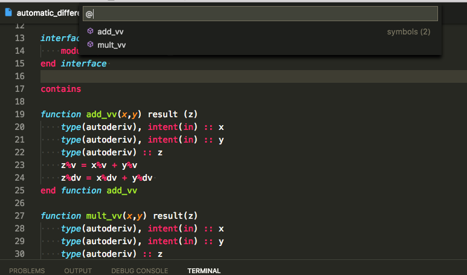

# Modern Fortran language support for VSCode

[](https://travis-ci.org/krvajal/vscode-fortran-support)
[](https://codecov.io/gh/krvajal/vscode-fortran-support)
[](http://opensource.org/licenses/MIT)
[](https://marketplace.visualstudio.com/items?itemName=krvajalm.linter-gfortran)
[](https://GitHub.com/krvajal/vscode-fortran-support/releases/)

> This extension provides support for the Fortran programming language. It includes syntax highlighting, debugging, code snippets and a linting based on `gfortran`. You can download the Visual Studio Code editor from [here](https://code.visualstudio.com/download).

## Features

- Syntax highlighting
- Code Snippets
- Documentation on hover for intrinsic functions
- Code linting based on `gfortran` to show errors wiggles in your code
- Code autocompletion (beta)
- Symbols provider
- Debugger, uses Microsoft's [C/C++ extension](https://github.com/Microsoft/vscode-cpptools)



## Settings

You can control the include paths to be used by the linter with the `fortran.includePaths` setting.

``` jsonc
{
    "fortran.includePaths": [
        "/usr/local/include",
         "/usr/local"
    ]
}
```

By default the `gfortran` executable is assumed to be found in the path. In order to use a different one or if it can't be found in the path you can point the extension to use a custom one with the `fortran.gfortranExecutable` setting.

``` jsonc
{
    "fortran.gfortranExecutable": "/usr/local/bin/gfortran-4.7",
}
```

If you want to pass extra options to the `gfortran` executable or override the default one, you can use the setting `fortran.linterExtraArgs`. By default `-Wall` is the only option.

``` jsonc
{
    "fortran.linterExtraArgs": ["-Wall"],
}
```

You can configure what kind of symbols will appear in the symbol list by using

``` jsonc
{
    "fortran.symbols": [ "function", "subroutine"]
}
```

The available options are

- "function"
- "subroutine"
- "variable"
- "module" (not supported yet)
- "program" (not supported yet)

and by default only functions and subroutines are shown

You can also configure the case for fortran intrinsics auto-complete by using

``` jsonc
{
    "fortran.preferredCase": "lowercase" | "uppercase"
}
```

## Snippets

This is a list of some of the snippets included, if you like to include additional snippets please let me know and I will add them.

#### Program skeleton


#### Module skeleton


## Error wiggles

To trigger code validations you must save the file first.

## Debugging

The extension uses the debugger from Microsoft's
[C/C++ extension](https://github.com/Microsoft/vscode-cpptools)
for Visual Studio Code. This allows this extension to use the full functionality
of the C/C++ extension for debugging applications:
(un)conditional breaking points, expression evaluation, multi-threaded debugging,
call stack, stepping, watch window.

A minimal `launch.json` script, responsible for controlling the debugger, is
provided below. However, Visual Studio Code is also capable of autogenerating
a `launch.json` file and the configurations inside the file.

More details about how to setup the debugger can be found in Microsoft's website:

- General information about debugging in VS Code: <https://code.visualstudio.com/docs/editor/debugging>
- C/C++ extension debugger information: <https://code.visualstudio.com/docs/cpp/cpp-debug>
- Build tasks for easy compiling: <https://code.visualstudio.com/docs/editor/tasks>

``` jsonc
{
    // Use IntelliSense to learn about possible attributes.
    // Hover to view descriptions of existing attributes.
    // For more information, visit: https://go.microsoft.com/fwlink/?linkid=830387
    "version": "0.2.0",
    "configurations": [
        {
            "name": "(gdb) Fortran",
            "type": "cppdbg",
            "request": "launch",
            "program": "${workspaceFolder}/a.out",
            "args": [], // Possible input args for a.out
            "stopAtEntry": false,
            "cwd": "${workspaceFolder}",
            "environment": [],
            "externalConsole": false,
            "MIMode": "gdb",
            "setupCommands": [
                {
                    "description": "Enable pretty-printing for gdb",
                    "text": "-enable-pretty-printing",
                    "ignoreFailures": true
                }
            ]
        }
    ]
}
```

## Requirements

For the linter to work you need to have `gfortran` on your path, or wherever you configure it to be.

For debugging you need to have one of the following debuggers installed:

- **Linux**: GDB
- **macOS**: GDB or LLDB
- **Windows**: GDB  or Visual Studio Windows Debugger

## Issues

Please report any issues and feature request on the GitHub repo [here](https://github.com/krvajalmiguelangel/vscode-fortran-support/issues/new)

## Notice

The syntax highlight support was imported from [TextMate bundle](https://github.com/textmate/fortran.tmbundle)

The idea of using `gfortran` comes from this awesome [fortran plugin](https://github.com/315234/SublimeFortran) for Sublime Text.

## LICENSE

MIT
